# Usage of the RRZE HPC Cluster
## Introduction

On a cluster you don't normally work directly with the computers performing your computations (the *compute nodes*). Instead, you connect to a special node (the *submit node*), submit your job there, and the cluster software will schedule it for execution on one of the compute nodes. As soon as the scheduler has found a node with the resources required for your job (and you haven't exceeded the maximum number of active jobs allowed for your account), the job is executed there.

The RRZE runs several clusters - we will use the *TinyGPU* cluster consisting of 38 nodes with different types of Nvidia GPUs.

## Account

To access the cluster a special account is required. The username for this account **differs from the usual FAU user ID**. To find your username and set up a password visit https://idm.fau.de/. The credentials are listed among "Special services"

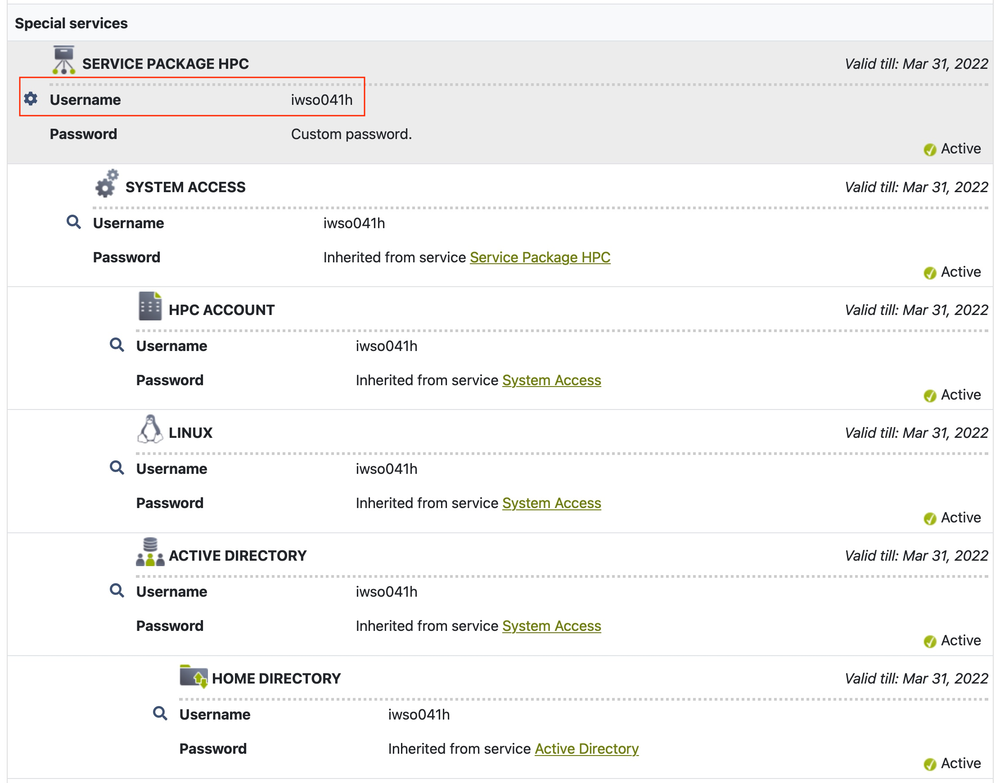

To set up a password for your account click the gear and select "Change Password"

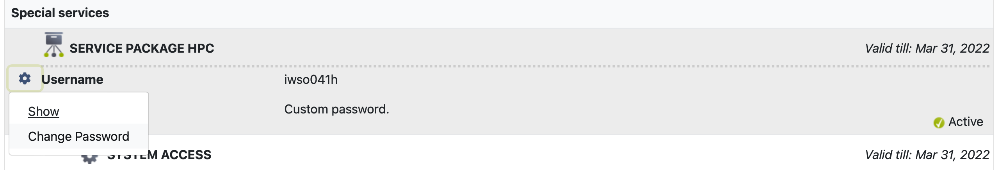

## Connect to the cluster 

The cluster frontend is only reachable from within the university network (in person or VPN). To access the cluster from outside of FAU we first need to connect to the dialog server `cshpc.rrze.fau.de` via ssh.

If you are using Linux, macOS or Windows 10 (build 1809 and newer) `ssh` comes preinstalled as a command line tool. For older Windows versions you can use PuTTY (https://www.putty.org). 

#### Linux / macOS / Windows 10 (build 1809 and newer)

Open up 

```bash
ssh username@cshpc.rrze.fau.de
```

From there we can accesss the cluster frontend `tinyx.nhr.fau.de` 


```bash
ssh tinyx.nhr.fau.de
```

**Note:** When you connect for the first time you have to confirm with yes that you trust the remote computer. 

#### Older Windows versions

Download and open PuTTY and select `ssh` as connection type. 

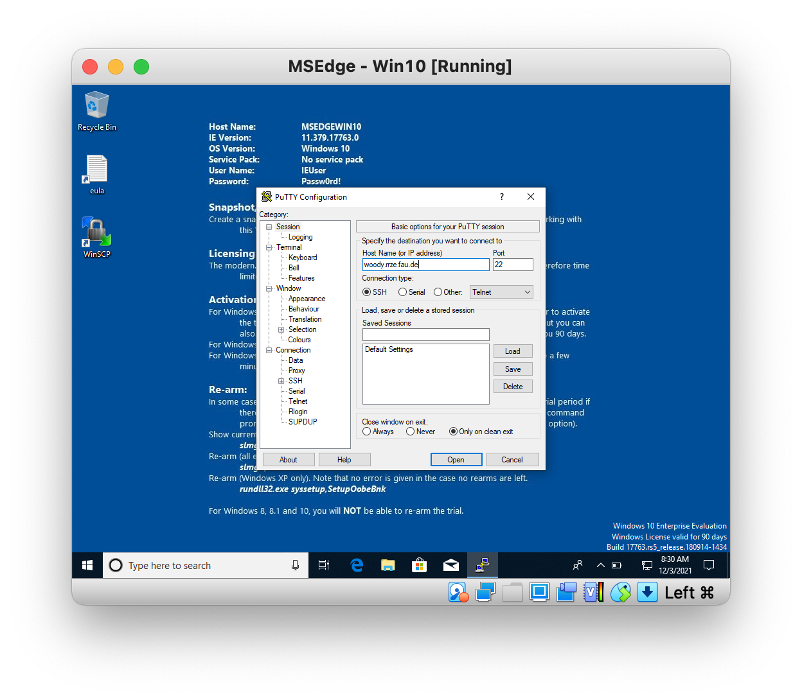

## Transfer Data to the Cluster

Code files are best transfered using git - you can clone your repository on the cluster. Large binaries, which should not be checked into git (i.e. the dataset) can be transfered via `scp`. On Unix-like operating systems like Linux or macOS `scp` comes preinstalled. On Windows you can use WinSCP (https://winscp.net/).

#### Linux / macOS: 

`cd` to the parent directory of the folder you want to transfer (in this tutorial the folder is called data) and run:

```bash
scp -r -p data username@cshpc.rrze.fau.de:~/foo/
```

The general syntax for the command is:

```bash
scp source target
```

This means it is sufficient to switch source and target to download files from the cluster, e.g.

```bash
scp -r -p username@cshpc.rrze.fau.de:~/foo/ ~/Downloads/
```

#### Windows:

1. Open WinSCP (https://winscp.net/)
2. Select New Session
3. Select *SCP* as file protocol from the dropdown menu
4. The hostname is `tinyx.nhr.fau.de`(inside FAU) or `cshpc.rrze.fau.de` (outside from FAU)
5. Provide your (HPC) username and password
6. Press Login

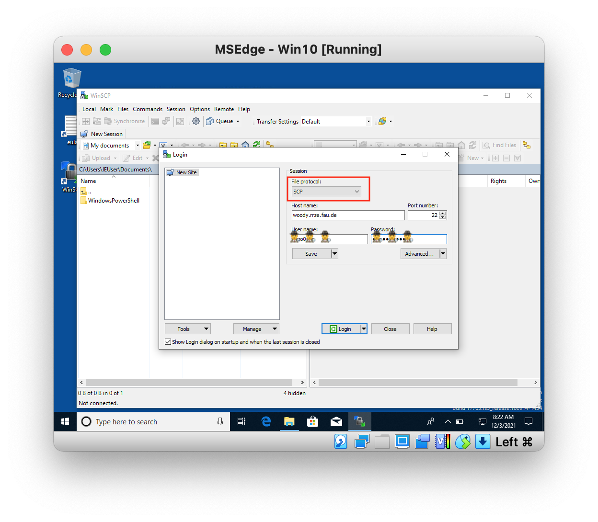

**Note:** When you connect for the first time from your computer you are asked if you trust the host. Select yes:

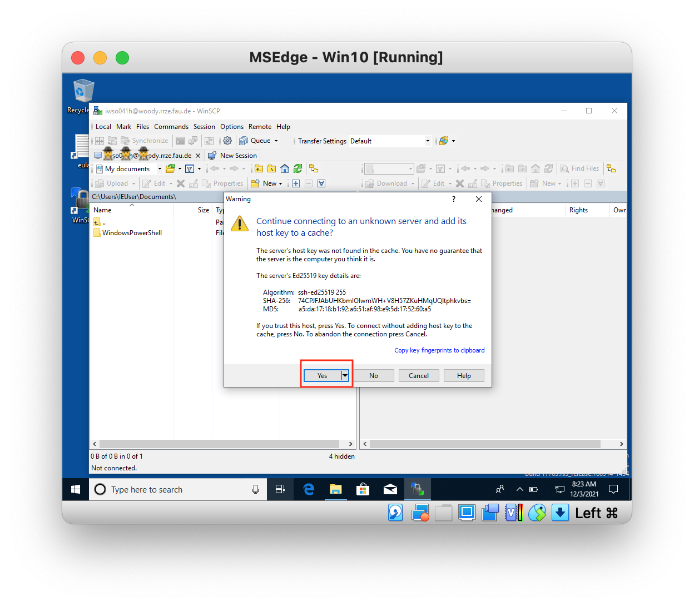

7. When connected you see on the left pane your local files and on the right pane the files of the remote computer (i.e. your home directory on the cluster)
8. Move to the directory you want to transfer to the cluster (e.g. dataset) and press `Ctrl + C` and paste it in the right pane at the location of your choice. 
9. Confirm your action by pressing OK 

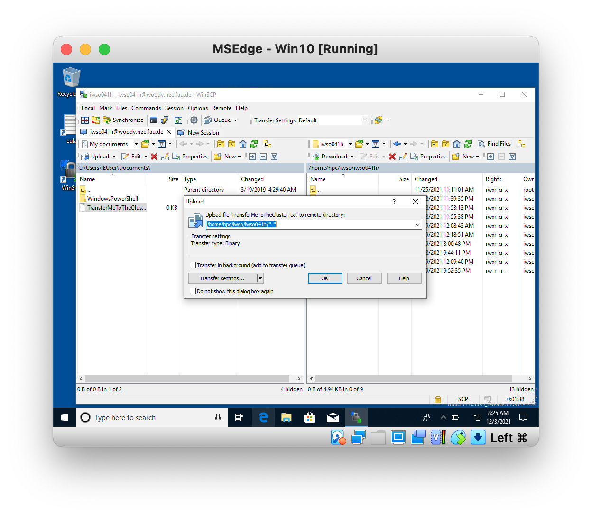

By copying files from the right pane to the left pane you can also download data from the cluster to your computer. 

## Setup Conda on the cluster

1. Connect via ssh to `tinyx.nhr.fau.de` as described previously.
2. Anaconda is already installed in the form of a module. To load anaconda type:

```bash
module load python
```

3. When you use conda for the first time with your account, run:

```bash
conda init bash
```

   **Note:** if conda tries to invoke sudo and asks for a password hit Ctrl+C to cancel. It works anyways.

4. Finish by running:

```bash
source ~/.bashrc
```

​	If you did everything successful your prompt starts with ``(base)`` 

5. To run conda whenever you are connecting to the cluster create a file ``.profile`` within your home using e.g. nano:

```bash
nano ~/.profile
```

​	A text editor will open. Paste the following:

```bash
if [ -n "$BASH_VERSION" ]; then
# include .bashrc if it exists
if [ -f "$HOME/.bashrc" ]; then
. "$HOME/.bashrc"
fi
fi
```

​	Save the file (Ctrl+O) and exit (Ctrl+X). 

6. By default packages are installed to ``~/.conda``. To prevent your home folder from hitting the quota change the default paths by following these steps:

```bash
conda config
```

​	Open the file in nano (``nano ~/.condarc``) and add the following lines to the file:

```bash
pkgs_dirs:
- ${WOODYHOME}/software/privat/conda/pkgs
envs_dirs:
- ${WOODYHOME}/software/privat/conda/envs
```

7. Everything is set up. To check your configuration you can call

```bash
conda info
```

8. Finally, create an environment. 

   You can either create an emtpy environment using the command below:

```bash
conda create --name=seminar python=3.9
```

​	Or you can use the `.yml`-file provided in the git repository to install the required packages automatically:

```bash
conda env create --file seminar.yml
```

​	If you decide **not to use** the `.yml` file use this command to install pytorch:

```bash
conda install pytorch torchvision torchaudio cudatoolkit=11.3 -c pytorch
```


##  Creating and Submitting Jobs

As described before, you do not access the cluster nodes directly, but instead submit a job which than allocates a node for your job. The software to manage these jobs is called SLURM (https://slurm.schedmd.com). Generally you want to collect all commands and parameters that you need for your job in a single bash script which is then submitted to slurm. 

The command to submit jobs is called `sbatch`. To submit a job to the TinyGPU cluster use

```bash
sbatch.tinygpu [options] <job script>
```

After submission, sbatch will output the **Job ID** of your job. It can later be used for identification purposes and is also available as the environment variable `$SLURM_JOBID` in job scripts.

Below is an example for a job script which handles everything needed to train a neural network:

```bash
#!/bin/bash -l
#SBATCH --job-name=IIML_Tut
#SBATCH --ntasks=1
#SBATCH --gres=gpu:1
#SBATCH --output=R-%x.%j.out
#SBATCH --error=R-%x.%j.err
#SBATCH --mail-type=end,fail 
#SBATCH --time=00:15:00
#SBATCH --export=NONE
unset SLURM_EXPORT_ENV

source ~/.bashrc

# Set proxy to access internet from the node
export http_proxy=http://proxy:80
export https_proxy=http://proxy:80

module purge
module load python

# Conda
source activate seminar

# create a temporary job dir on $WORK
mkdir ${WORK}/$SLURM_JOB_ID
cd ${WORK}/$SLURM_JOB_ID

# copy input file from location where job was submitted, and run 
cp -r ${SLURM_SUBMIT_DIR}/. .
mkdir -p output/logs/
mkdir -p output/checkpoints/

# Run training script
srun python src/Training.py 

# Create a directory on $HOME and copy the results from our training
mkdir ${HOME}/$SLURM_JOB_ID
cp -r ./output/. ${HOME}/$SLURM_JOB_ID

```

To submit this script type

```bash
sbatch.tinygpu TrainCluster.sh
```

from the directory where you have the code. 

**Explanation of `sbatch` options**:

| Option                | Explanation                                                  |
| :-------------------- | :----------------------------------------------------------- |
| `--job-name=<name>`   | Specifies the name for the job. This is shown in the queue   |
| `--ntasks=<number>`   | number of parallel tasks. In our case always 1               |
| `--gres=gpu:1`        | Use GPU, if you want to use a specific GPU type use e.g. `--gres=gpu:rtx3080:1` |
| `--output=<filename>` | stdout is redirected into this file, i.e. when you call `print()` in python it will appear in this file |
| `--error=<filename`>  | stderr is redirected into this file. If your training is crashing check this file. |
| `--mail-type=<type>`  | Sends an email to you depending on `<type>`. Types are: `BEGIN`, `END`, `FAIL`, `TIME_LIMIT` or `ALL`. |
| `--time=HH:MM:SS`     | Specifies how long your job is running. If you exceed your time slurm will kill your job. (Max 24h). |
|                       |                                                              |

##### Useful commands for Slurm:

| **Command**                         | Purpose                                                      |
| ----------------------------------- | ------------------------------------------------------------ |
| `squeue.tinygpu`                    | Displays information on jobs. Only the user’s own jobs are displayed. |
| `scancel.tinygpu <JobID>`           | Removes job from queue or terminates it if it’s already running. |
| `scontrol.tinygpu show job <JobID>` | Displays very detailed information on jobs.                  |

To avoid to type this commands every time you can define an alias by adding the following lines to  your `.bashrc` 

```bash
alias sq="squeue.tinygpu"
alias sb="sbatch.tinygpu"
```


#### Debugging with an interactive slurm shell

You can request an interactive shell, too. This is especially useful if you want to debug your code or check if everything works before submitting a hour-long training job. 

To generate an interactive Slurm shell on one of the compute nodes, the following command has to be issued on the woody frontend:

```bash
salloc.tinygpu --gres=gpu:1 --time=00:30:00
```

When your job allocation is granted your connect automatically to the corresponding node. To use python within the interactive shell the following commands need to be issued: 

```bash
module load python
source ~/.bashrc
source activate seminar # or the name of your conda env
```

## Tensorboard

Tensorboard visualizes the progress of your training (e.g. the loss curve, accuracy, etc.). 

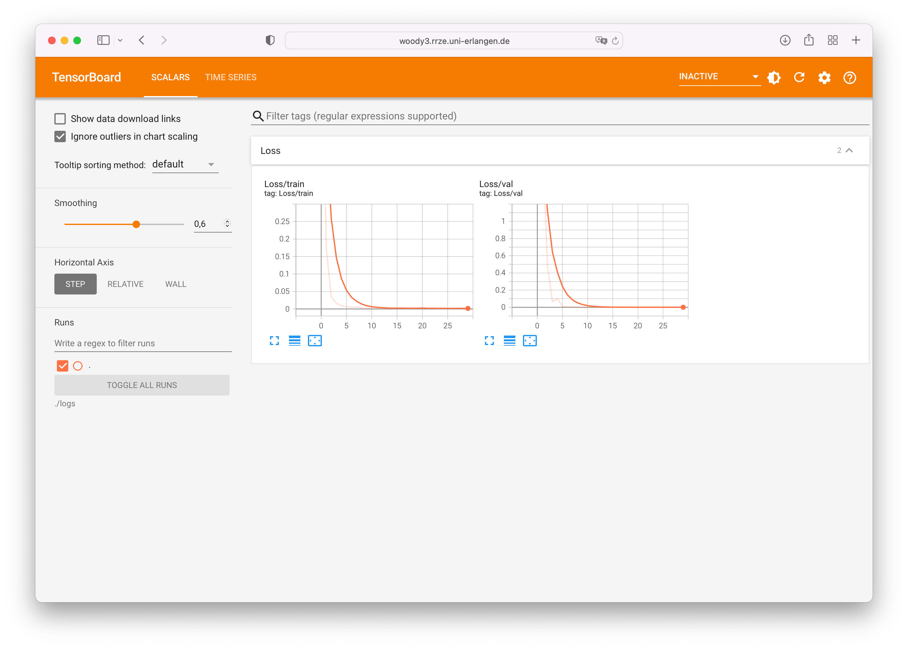

You can either copy the logs to your local machine and run tensorboard from there or you can run tensorboard from the cluster frontend (`tinyx.nhr.fau.de`). 

1. Connect via VPN to the university network
2. `ssh` to `tinyx.nhr.fau.de`
3. run `tensorboard --logdir=/path/to/your/logs --bind_all`
4. Tensorboard will give you the URL to the tensorboard. Typically http://woody3.rrze.uni-erlangen.de:6006/ (Press CTRL+C to quit)
5. Open the URL in your browser

## Jupyter

If you prefer Jupyter Notebooks you can use https://jupyterhub.rrze.uni-erlangen.de/hub/login. You can login with your HPC account. You need to be in the university network or use a VPN to the university network. 

To use your `conda` environment install the following package:

```bash
conda install -c anaconda ipykernel
```


## Running the Example

In the repository you'll find a small training script as an example. The following steps describe how to get the example running **once you've set up conda**:

1. `ssh` to the cluster frontend 

```bash
ssh username@tinyx.nhr.fau.de
```

2. Clone the git repository with the example code

```bash
git clone https://gitlab.cs.fau.de/aimi-lab/3-teaching/wise2021_iiml_mura.git
```

3. Download the dataset from Google Drive: https://drive.google.com/drive/folders/1GXhjcsnwC5JxmWGkjCsY8Tifz3m8shIx?usp=sharing to your local machine (you can also use `curl` )
4. Open up a second Terminal-Window and use `scp` to transfer the downloaded dataset to the cluster

```bash
scp -r ~/Downloads/data.zip username@tinyx.nhr.fau.de:~/repos/wise2021_iiml_mura/cluster/
```

5. Go to the directory of the example:

```bash
cd wise2021_iiml_mura/cluster/
```
and unzip the downloaded zip
```bash
unzip data.zip
```
6. Submit job:

```bash
sbatch.tinygpu TrainCluster.sh
```

## Edit files directly on the cluster using VSCode

To edit files directly on the cluster you can use the Visual Studio Code Remote - SSH extension. This will install a small webserver into your home directory on the cluster, used to display remote code into your local VSCode instance.

### Install Remote SSH

Open the Extensions view (⇧⌘X on Mac, Ctrl+⇧+X on Linux/Windows) and search for `Remote - SSH`. If not done, install by pressing the install button.

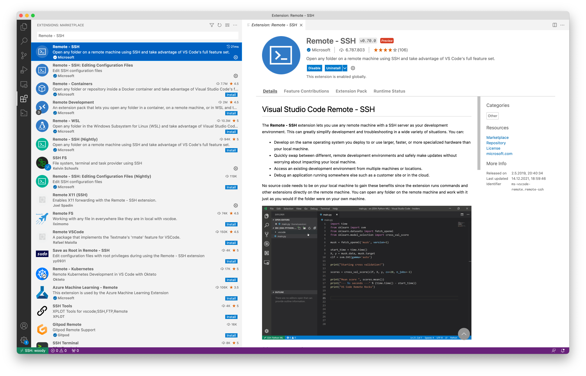

### Setup Hosts in a configuration file

In the left pane open the Remote Explorer and select the gear icon to access the settings.

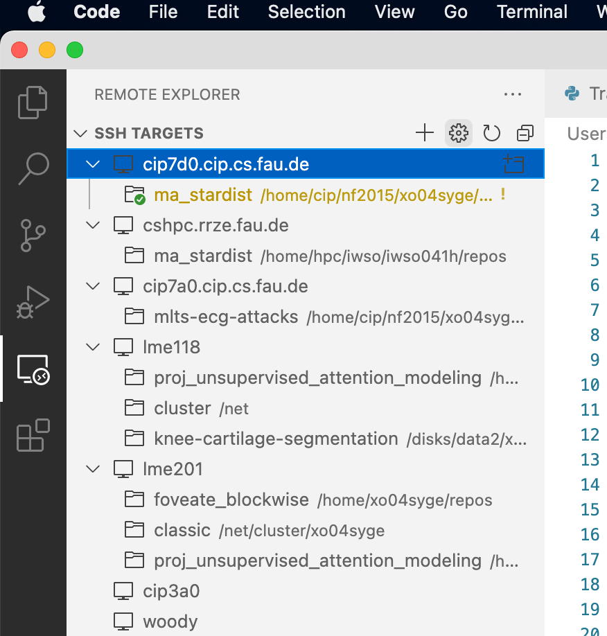

A small window will open where you can select which SSH configuration you want to update (usually the one within your home)

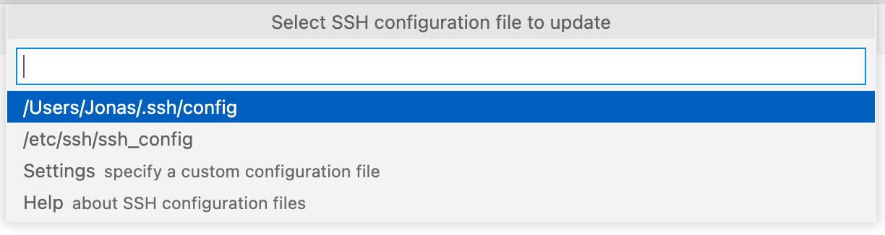

The config file is a text document. Add the following lines to your configuration:

```bash
Host cshpc
  HostName cshpc.rrze.fau.de
  User iwso041h 
  IdentityFile ~/.ssh/clusterdialog 

Host tinyx
  HostName tinyx.nhr.fau.de
  ProxyCommand ssh -q -W %h:%p cshpc
  User iwso041h 
  IdentityFile ~/.ssh/cresty
```

If you do not have a private key for ssh you can remove the lines with `IdentityFile`, otherwise specify the location of your private key. (If you specify a key you do not have to type your password each time you want to connect).

### Connect to Host and Edit Files

Select the host you want to connect to from the SSH Targets in the left pane. A green bar in the bottom indicates the status of connection. Once connected you can open folders or repos just like on your local computer.

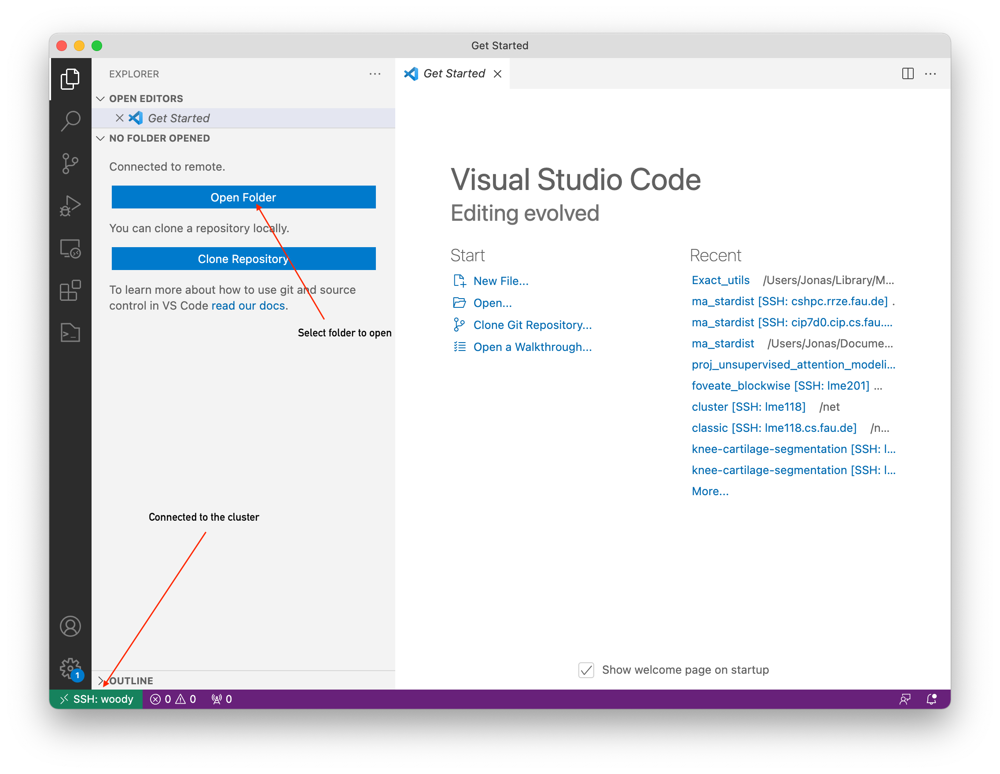

**Note:** :warning: :warning: :warning: Do **<u>not</u>** run your training directly on `woody`. Submit your jobs as described above! :warning: :warning: :warning:

## Useful Linux commands

If you are not familiar with the Linux shell help yourself with a (non-exhaustive) list of useful commands:

| Command                      | Purpose                                                      |
| ---------------------------- | ------------------------------------------------------------ |
| `cd directory`               | Change current directory to `directory`. Example: `cd ~/datasets/` |
| `mv source_dir target_dir `  | Move directory. Example: `mv models ~/archive/`. Can also be used to rename files e.g. `mv oldname newname` |
| `cp source_file target_file` | Copy files (or directories by specifying `-r`). Example: `cp -r models ~/archive/` |
| `rm file`                    | Remove files (or directories by specifying `-r`) . Example: `rm -r ~/proj/models/foo` |
| `ls -lash`                   | List files of a directory and show additional file attributes |
| `du -h`                      | show disk usage of files and directories                     |
| `cat filename`               | Show the content of a file, e.g. your log files. Example `cat loss.txt` |
| `grep pattern file`          | Search for a pattern in a file or stdin. Example `grep "Epoch: 4" log.txt` |
| `nano filename`              | Light-weight text-editor. Useful for config files etc.       |
| `quota -s`                   | See quota for storage in human-readable format       |


Last updated: 21.02.2023
